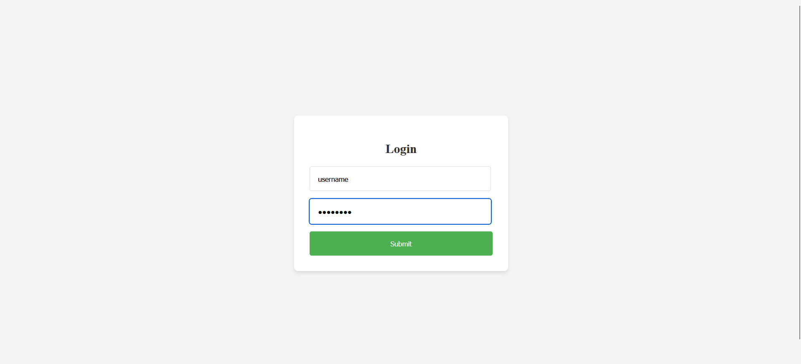
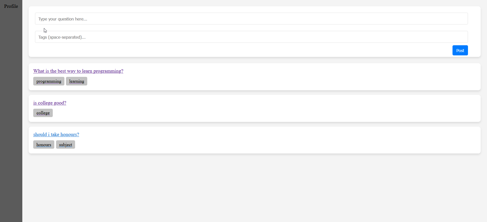

# CampusConnect 🎓

**CampusConnect** is a comprehensive student platform that brings together academic collaboration, resource sharing, and event coordination in one seamless interface. Built with modern web technologies, it serves as a digital hub for campus life.

## 🌐 Overview

CampusConnect eliminates the fragmentation of student tools by providing a centralized platform where students can:
- Ask and answer academic questions
- Share and access study resources
- Stay updated on campus events
- Build a collaborative learning community

The platform features an intuitive hover-based navigation system and a clean, responsive design that adapts to different screen sizes.

## ✨ Features

### 🔐 **Authentication System**
- Secure user login with MongoDB-backed authentication
- Session management with user state persistence
- Protected routes ensuring secure access

### 💬 **Q&A Forum**
- Post questions with custom tags for easy categorization
- Real-time answer posting and viewing
- User attribution for questions and answers
- Clean, card-based interface for better readability

### 📚 **Resource Hub**
- Upload and download academic materials
- Previous year papers and study guides
- Marketplace functionality for second-hand items
- Organized resource cards with download capabilities

### 🎉 **Events Management**
- Campus event listings with image support
- Event descriptions and details
- Admin-controlled event posting
- Visual event cards with proper spacing

### 🎨 **Modern UI/UX**
- Responsive hover panel navigation
- Smooth animations and transitions
- Card-based layout system
- Mobile-friendly design

## 📸 Screenshots

### Login Interface

*Clean and secure login interface with error handling*

### Question Forum

*Interactive Q&A forum with tagging system and real-time updates*

### Demo Video
[](./Images/CampusConnect.mp4)
*Complete application walkthrough showcasing all features*

## 🛠️ Tech Stack

### Frontend
- **React.js 18.3.1** - Modern UI library with hooks
- **React Router DOM 6.27.0** - Client-side routing
- **Axios 1.7.7** - HTTP client for API communication
- **CSS3** - Custom styling with flexbox and animations

### Backend
- **Node.js** - JavaScript runtime
- **Express.js 4.21.0** - Web application framework
- **MongoDB** - NoSQL database
- **Mongoose 8.7.0** - MongoDB object modeling
- **CORS 2.8.5** - Cross-origin resource sharing
- **dotenv 16.4.5** - Environment variable management

## 📁 Project Structure

```
CampusConnect/
├── client/                     # Frontend React application
│   ├── public/                 # Public assets
│   └── src/                    # Source files
│       ├── components/          # Reusable components
│       ├── pages/               # Page components
│       ├── App.js               # Main app component
│       └── index.js             # Entry point
└── server/                     # Backend Node.js application
    ├── config/                 # Configuration files
    ├── controllers/            # Route controllers
    ├── models/                 # Database models
    ├── routes/                 # API routes
    ├── .env                    # Environment variables
    ├── server.js               # Entry point
    └── package.json            # Backend dependencies
```

## 🚀 Getting Started

To get a local copy up and running, follow these simple steps.

### Prerequisites

- Node.js installed on your machine.
- MongoDB Atlas account for database hosting.

### Installation

1. Clone the repo
   ```sh
   git clone https://github.com/your_username_/CampusConnect.git
   ```
2. Install NPM packages
   ```sh
   npm install
   ```
3. Set up environment variables
   - Rename `.env.example` to `.env`
   - Add your MongoDB URI to `MONGODB_URI`

4. Run the development server
   ```sh
   npm run dev
   ```

### Usage

- Navigate to `http://localhost:3000` in your web browser.
- Register a new account or log in with an existing one.
- Explore the Q&A forum, resource hub, and upcoming events.
- Participate in discussions, share resources, and collaborate with peers.

## 🤝 Contributing

Contributions are what make the open-source community such an amazing place to learn, inspire, and create. Any contributions you make are **greatly appreciated**.

1. Fork the Project
2. Create your Feature Branch (`git checkout -b feature/AmazingFeature`)
3. Commit your Changes (`git commit -m 'Add some AmazingFeature'`)
4. Push to the Branch (`git push origin feature/AmazingFeature`)
5. Open a Pull Request

## 📄 License

Distributed under the MIT License. See `LICENSE` for more information.

## 📫 Contact

Your Name - [@your_twitter](https://twitter.com/your_username) - your_email@example.com

Project Link: [https://github.com/your_username_/CampusConnect](https://github.com/your_username_/CampusConnect)
